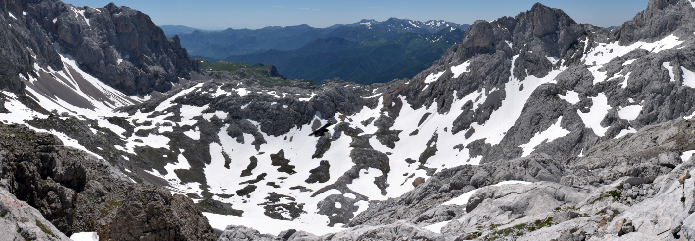

```{r setup, include=FALSE}
knitr::opts_chunk$set(echo = TRUE)
```



# Microclimatic buffering prevents homogenization of relict alpine communities

## Contents

This repository is organised following the advice of [Wilson et al. 2017](https://doi.org/10.1371/journal.pcbi.1005510) for recording and storing research projects.

The following materials are available in the folders of this repository:

* `data` Primary data used for the analyses, tables and figures presented in the manuscript.
* `src` Scripts in `R` language to conduct the analyses and produce the tables and figures presented in the manuscript.
* `results` Output of the `R` scripts, including figures, tables and supplementary materials.
* `doc` Manuscript files.

## Citation

Please cite this repository as:

> Jiménez-Alfaro B, Fernández-Pascual E, Espinosa del Alba C, Marcenò C (2023) Microclimatic buffering prevents homogenization of relict alpine communities.
