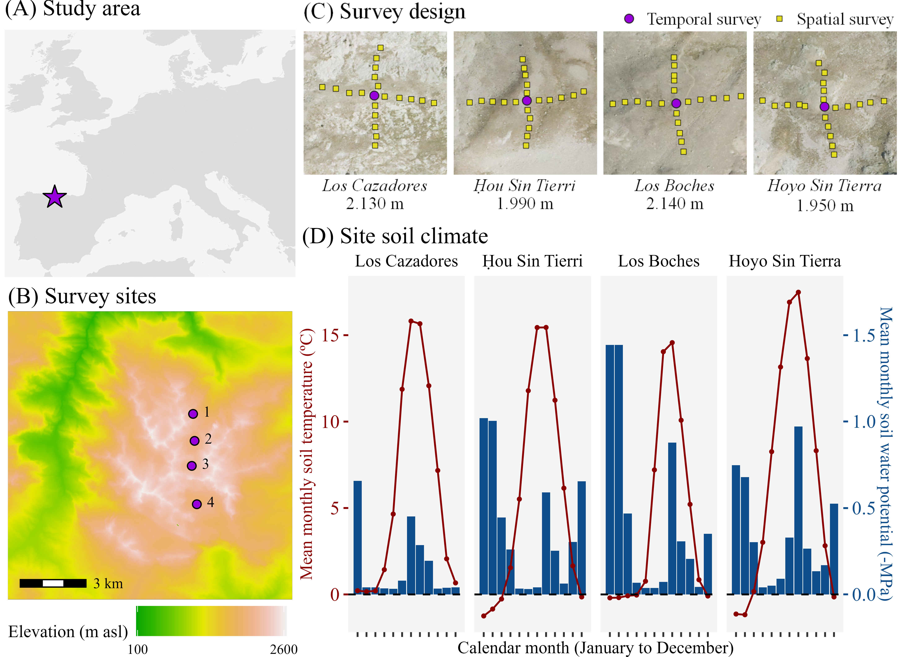
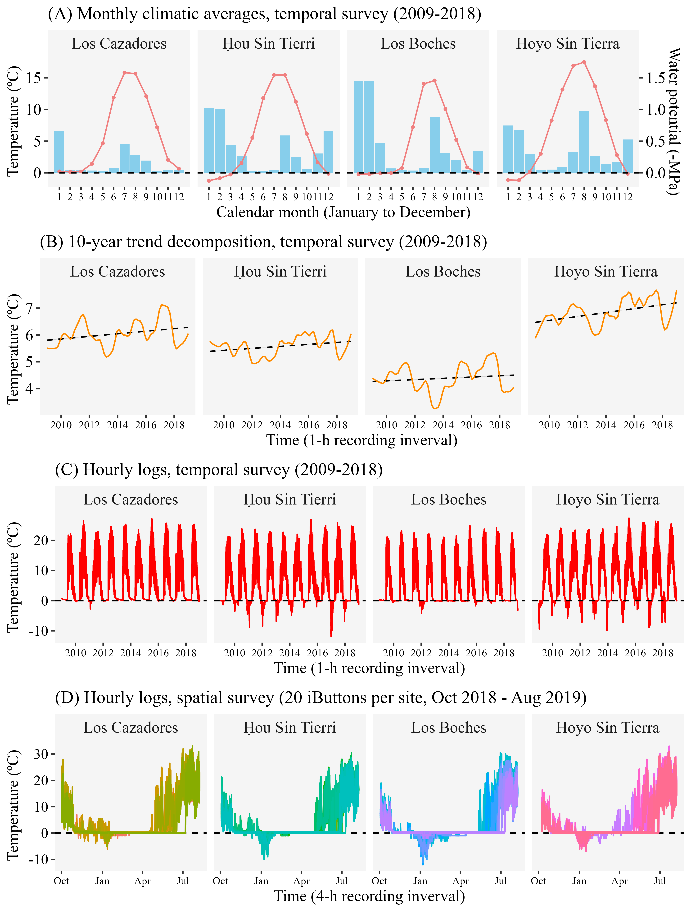
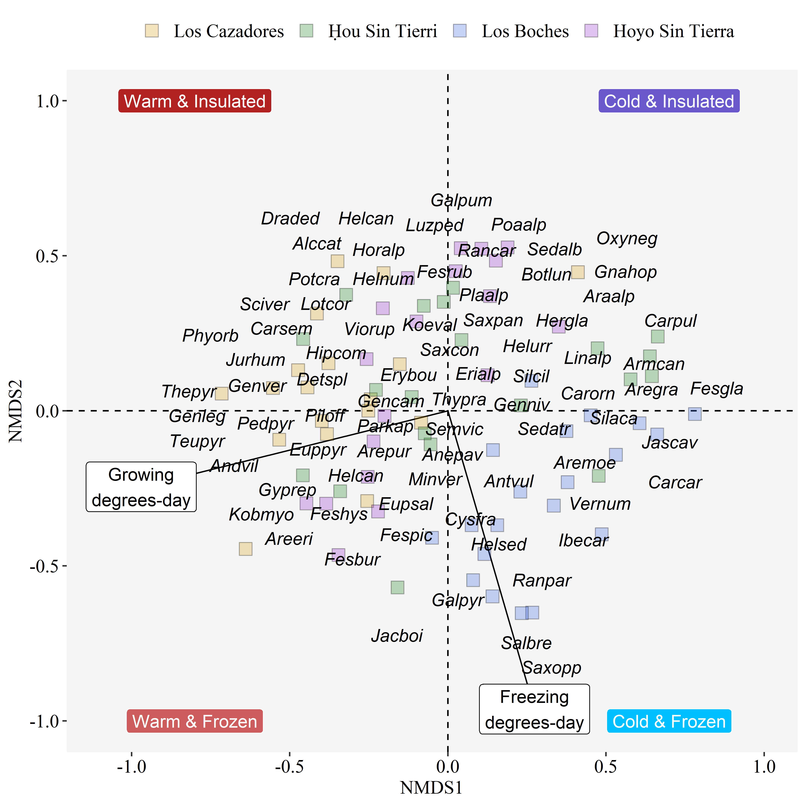

```{r setup, include=FALSE}
knitr::opts_chunk$set(echo = TRUE)
```

```{r}
library(vegan); library(tidyverse)
load("../results/numerical/environmental-fit.R")
load("../results/numerical/bioclim-correlations.R")
```

B Jiménez-Alfaro, E Fernández-Pascual, A Bueno, C Marcenó....¿?

# Abstract (ME&B)

Alpine vegetation is considered to respond to climate change through species distribution shifts with effects on community richness and composition. However, the complex topography of alpine landscapes creates a mosaic of microclimatic niches which might buffer macroclimatic variation, preventing local extinctions of alpine species. The magnitude of microclimatic buffering is context-dependent and may depend on regional factors such as biogeographical settings, topography, or species pools. A key question for understanding the magnitude of this buffering is therefore to test whether spatial topographic variation reflects temporal changes within and between years in different regions. We addressed this question in a long-term vegetation monitoring site in Picos de Europa National Park, a transitional mountain massif between the temperate and Mediterranean macroclimates in northern Spain. In 2008, we established four stations along an alpine landscape for measuring temporal changes in soil temperatures and related changes in plant communities based on two 1 m2 plots replicated around the central point. In 2018, we also measured spatial variation in soil temperatures within each station using 20 additional plots placed at 10 m intervals along with cardinal directions from the central point. We found that spatial variation was higher than 10-year temporal variation for most of the bioclimatic indices we used, but there were exceptions in stations that accumulate less snow, and in less topographically diverse stations. Vegetation variation (Sørensen index) was higher across topographical gradients than across time. These results suggest that microclimatic refugia can compensate for temporal changes, but this compensation might not be homogeneous throughout the alpine landscape. The response of the study system to contemporary climate warming seems more likely to produce a slow re-accommodation of species relative abundances along with topographical variation, rather than local extinctions.

# Introduction

xxx

# Methods

## Study system

The study was conducted in the central calcareous massif of the Picos de Europa National Park, in northern Spain (Figure 1A). The study area is a biodiversity hotspot for cold-adapted plants in the Iberian Peninsula and a biogeographical hub for Alpine and Mediterranean lineages in Western Europe (XXX). The central calcareous massif occupies c. 50 km^2^ and support high diversity of ecosystems, with alpine vegetation mostly occurring between 1900 and 2400 m a.s.l., with a local species pool of XX species (Jiménez-Alfaro et al. XXX). In 2008, we established a long-term ecological research program for monitoring soil climate and vegetation change. We selected four study sites along a north-south gradient, reflecting the main macroclimatic variation from oceanic to Mediterranean influence. The sites were selected to... general design and description of sites... (Borja)

## Vegetation and microclimatic data

In each site, we buried a temperature logger (XXXX) at 5 cm depth in a relatively flat and homogeneous vegetation patch. We surveyed the plant community in two replicated plots of 1 m2 separated 1 m from the logger, identifying species composition and estimating relative cover in %. In each plot, we installed a grid template of 100 microplots (10 x 10 cm each) to sample species frequency according to the standard methodology of GLORIA (XXX). The loggers were replaced by new ones, when needed, to obtain a continuous temperature record from 2008 to 2018. In 2018, we resampled the same plots in the same way to detect potential changes in species presence and frequency. The vegetation data from these surveys, together with the soil temperature collected in the four study sites during 10 years, represent the "temporal survey". In 2019, we visited the same areas to study the spatial variation of vegetation and microclimate around the previously sampled areas. Using the long-term temperature logger as the central point, we additionally placed 20 ibuttons (XXX) in 20 plots of 1 m2 separated 10 m from each other in the four cardinal directions (Figure 1C).. etc... (Borja)

## Data analysis

[@RN2315]

Vegetation data + Temperature data (Eduardo)

# Results

## Microclimatic variation

Along the 10 years of soil temperature monitoring, we found a general trend of increasing temperature, especially in the southwest and warmest site (Hoyo sin Tierra) (Figure 3). Two of the sites (Los Cazadores and Los Boches) showed a consistent pattern of continuous snow cover during winter (reflected by temperature records around 0º C). In contrast, the two other sites (Hoy Sin Tierri and Hoyo Sin Tierra) showed frost temperatures during most winters (although they may not be constant and intermixed with short snow periods). Maximum temperatures were... Soil temperature corresponding to the spatial surveys also showed high variation within sites (Figure 3). In the four sites we found plots with contrasting patterns of snow cover and frost during winter, reflected by... When looking at the whole microclimatic variation among plots (Figure 4), we found that the four sites were represented by a wide range of temperatures, with the exception of one site (Los Cazadores). The two main axes of variation were mainly related to FDD and GDD, the latter also correlated with.... (Eduardo)

## Plant diversity and microclimate

Across the whole study system (temporal and spatial surveys) we recorded 86 species of vascular plants (considering *Helianthemum apenninum* subsp. *urrielense* and *Helianthemum apenninum* subsp. *cantabricum* as separate species), representing % of the total species pool of the study region. The five most frequent species were *Thymus praecox* subsp. *ligusticus* (83 occurences), *Anthyllis vulneraria* (73), *Koeleria vallesiana* (59), *Minuartia verna* (55) and *Helianthemum canum* (52). Average species richness per 1m^2^ plot was 13, with the richest plot having 25 species and the poorest one just two. 

In the temporal survey (2 visits x 2 plots per site, n = 16) we recorded 42 species in 2009 and 47 in 2019. Of the species recorded in 2009, we did not find again in 2019 the following three: *Festuca burnatii*, *Galium pyrenaicum* and *Iberis carnosa*. Conversely, in 2019 we recorded eight species that we had not seen in 2009: *Arenaria purpurascens*, *Lotus corniculatus*, *Potentilla crantzii*, *Sedum album*, *Sedum brevifolium*, *Seseli montanum*, *Silene ciliata* and *Solidago virgaurea*. Of these species that appeared or disappeared from the temporal survey plots, *Arenaria purpurascens* appeared in 12 10x10 cm cells in 2019, while the rest of the cases amounted to less than 10 cells. The five species with the highest decrease in frequency from 2009 to 2019 (ignoring annual species and species that occurred in less than 10 10x10 cm cells in 2009) were *Armeria cantabrica* (85% decrease in frequency, present in 13 cells in 2009), *Poa alpina* (-83%, 18 cells), *Salix breviserrata* (-48%, 25 cells), *Jurinea humilis* (-26%, 23 cells) and *Ranunculus parnassiifolius* subsp. *favargeri* (-18%, 72 cells). The five species with the highest increases (again, ignoring annual species and species that occurred in less than 10 10x10 cm cells in 2009) were *Minuartia verna* (+278%, 19 cells), *Helianthemum apenninum* subsp. *urrielense* (+87%, 63 cells), *Arenaria moehringioides* (+85%, 13 cells), *Saxifraga conifera* (+83%, 24 cells) and *Silene acaulis* (+39%, 18 cells).

Changes in species frequency were/were not correlated with XX and XX.... (Table 1) (Eduardo). In the spatial survey (20 plots per site, n = 80; including one plot placed in rocks with no vascular plants) we recorded 81 species, 36 of which were absent from the temporal survey plots. 

Changes in species composition (**Fig. 4**) were associated to GDD (NMDS axis 1) to represent a main gradient from the warmest to the coldest microsites, and to FDD (NMDS2) in a gradient of snow versus frost winters. In the compositional space, the sites were poorly differentiated across the four sites (PERMANOVA, adonis) mainly by the effect of one site (Los Boches) with most plots places in the cold and frost margins. Etc.... (Borja).

Results of the environmental fit:

```{r}
print(ef1)
```

Correlations between bioclimatic variables:

```{r}
print(biocor)
```

Let us keep GDD, bio7 and FDD for plotting NMDS (low autocorrelation, high r2 in environmental fit)

## Microclimatic ranges in time and space

.... (Eduardo) (quizás repensar esta parte, pero es importante mantenerla porque es la clave).

## Figures

```{r fig1, echo = FALSE, fig.pos = "H", fig.cap = "**Figure 1** Study system."}

```

```{r fig2, echo = FALSE, fig.pos = "H", fig.cap = "**Figure 1** Study system."}

```

```{r fig3, echo = FALSE, fig.pos = "H", fig.cap = "**Figure 1** Study system."}
knitr::include_graphics("../results/figures/pca-temperatures.png")
```

```{r fig4, echo = FALSE, fig.pos = "H", fig.cap = "**Figure 1** Study system."}

```

```{r fig5, echo = FALSE, fig.pos = "H", fig.cap = "**Figure 1** Study system."}
knitr::include_graphics("../results/figures/spp-changes.png")
```


## Tables

```{r echo = FALSE, fig.cap = "**Figure 1** Study system."}
read.csv("../results/tables/T1 - Summary of the GLM models of species presence.csv", check.names = FALSE) %>%
  kableExtra::kbl(caption = "Table 1 Summary of the GLM models of species presence") %>%
  kableExtra::kable_classic(., full_width = F)
```
